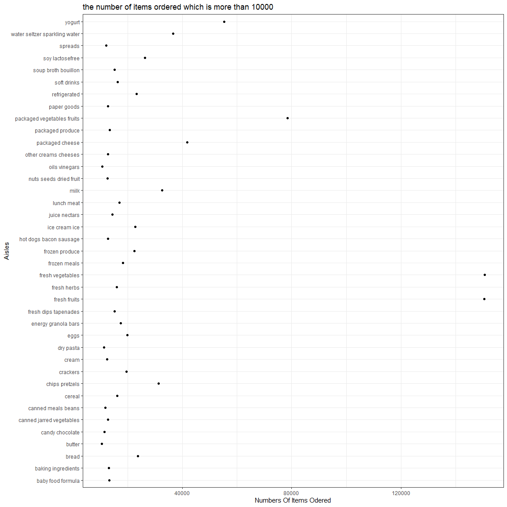
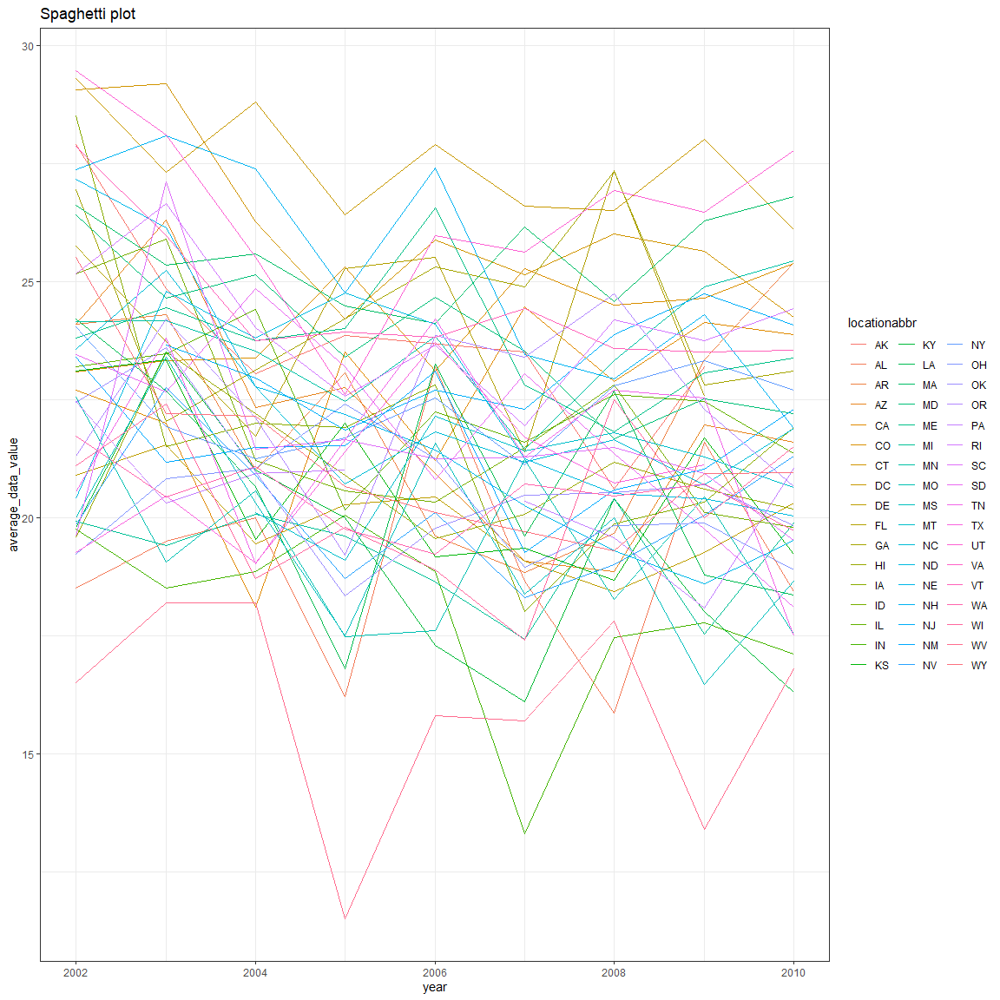
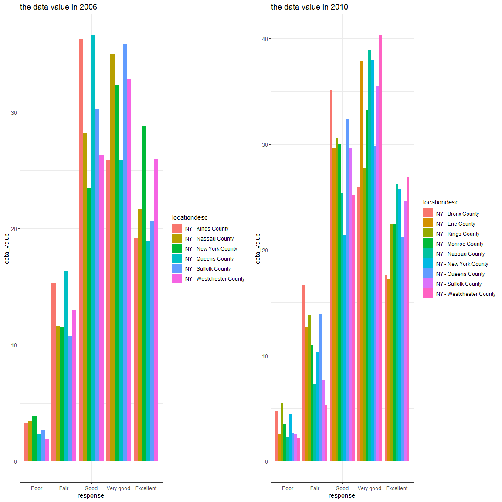
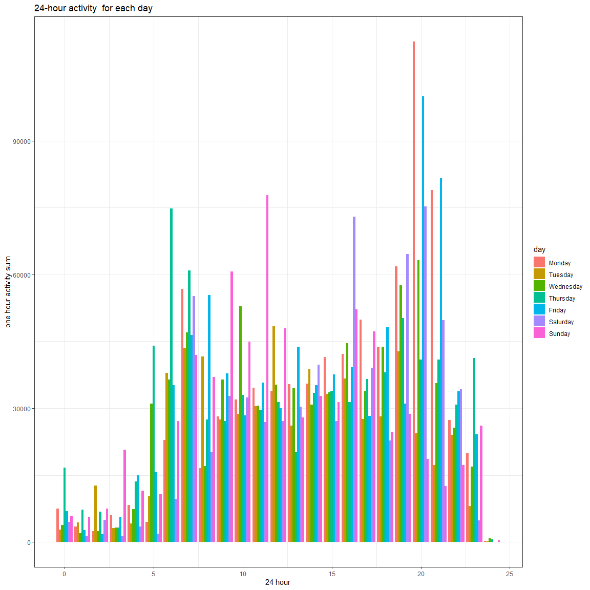

hw3\_yy3020
================
YuaoYang
2019/10/13

``` r
library(patchwork)
library(tidyverse)
```

    ## -- Attaching packages ------------------------------------------------ tidyverse 1.2.1 --

    ## √ ggplot2 3.2.1     √ purrr   0.3.2
    ## √ tibble  2.1.3     √ dplyr   0.8.3
    ## √ tidyr   1.0.0     √ stringr 1.4.0
    ## √ readr   1.3.1     √ forcats 0.4.0

    ## -- Conflicts --------------------------------------------------- tidyverse_conflicts() --
    ## x dplyr::filter() masks stats::filter()
    ## x dplyr::lag()    masks stats::lag()

``` r
library(p8105.datasets)

knitr::opts_chunk$set(
  fig.width = 12,
  fig.asp = 1,
  out.width = "100%"
)

theme_set(theme_bw() + theme(legend.position = "right"))
```

# Problem 1

``` r
data("instacart")
instacart
```

    ## # A tibble: 1,384,617 x 15
    ##    order_id product_id add_to_cart_ord~ reordered user_id eval_set
    ##       <int>      <int>            <int>     <int>   <int> <chr>   
    ##  1        1      49302                1         1  112108 train   
    ##  2        1      11109                2         1  112108 train   
    ##  3        1      10246                3         0  112108 train   
    ##  4        1      49683                4         0  112108 train   
    ##  5        1      43633                5         1  112108 train   
    ##  6        1      13176                6         0  112108 train   
    ##  7        1      47209                7         0  112108 train   
    ##  8        1      22035                8         1  112108 train   
    ##  9       36      39612                1         0   79431 train   
    ## 10       36      19660                2         1   79431 train   
    ## # ... with 1,384,607 more rows, and 9 more variables: order_number <int>,
    ## #   order_dow <int>, order_hour_of_day <int>,
    ## #   days_since_prior_order <int>, product_name <chr>, aisle_id <int>,
    ## #   department_id <int>, aisle <chr>, department <chr>

There are {1384617} observations and the structure of dataset is
(1384617, 15)in this dataset. And the key variables are(order\_id,
product\_id, add\_to\_cart\_order, reordered, user\_id, eval\_set,
order\_number, order\_dow, order\_hour\_of\_day,
days\_since\_prior\_order, product\_name, aisle\_id, department\_id,
aisle, department). The fisrt row means the identifier is {1}, the
product identifier is {49302}, order in which this product was added to
cart is {1}, and this prodcut has been ordered by this user in the past
by user id {112108}, evaluation set this order belongs in {train}, the
order sequence number for this user is {4}, the day of the week on this
order was placed on {4} day, the hour of the day on which the order is
placed on {10}, days since the last order is {9}, the name of this
product is {Bulgarian Yogurt}, the aisle identifier is {120} and name is
{yogurt}which belongs to department {dairy eggs} and the id of this
department is {16}.

``` r
aisle_new = instacart%>%
  group_by(aisle) %>%
  count() %>%
  arrange(n) 
most = pull(aisle_new[134, 1])
```

There are {134} aisles, and the most odered item is {fresh vegetables}.

``` r
 instacart%>%
  group_by(aisle) %>%
  count() %>%
filter(n >10000) %>%
 ggplot(aes(x = n, y =aisle)) +
  geom_point() +
 labs(
   title = "the number of items ordered which is more than 10000",
    x = "Numbers Of Items Odered",
    y = "Aisles"
   ) 
```


From the plot, we can find that the fresh vegetablea and fresh fruits
are most odered items.

``` r
instacart %>%
  filter(aisle %in% c('baking ingredients', 'dog food care', 'packaged vegetables fruits')) %>%
select(aisle, product_name) %>%
   group_by(aisle,product_name) %>%  
  count() %>% 
   group_by(aisle)%>%
  filter(min_rank(desc(n))<=3)%>%
  knitr::kable()
```

| aisle                      | product\_name                                 |    n |
| :------------------------- | :-------------------------------------------- | ---: |
| baking ingredients         | Cane Sugar                                    |  336 |
| baking ingredients         | Light Brown Sugar                             |  499 |
| baking ingredients         | Pure Baking Soda                              |  387 |
| dog food care              | Organix Chicken & Brown Rice Recipe           |   28 |
| dog food care              | Small Dog Biscuits                            |   26 |
| dog food care              | Snack Sticks Chicken & Rice Recipe Dog Treats |   30 |
| packaged vegetables fruits | Organic Baby Spinach                          | 9784 |
| packaged vegetables fruits | Organic Blueberries                           | 4966 |
| packaged vegetables fruits | Organic Raspberries                           | 5546 |

\#From the table, I find the most ordered items are cane sugar, light
brown sugar and pure baking soda in aisle baking ingredients.The most
ordered items are organix chicken & brown rice recipe, small dog
biscuits and snack sticks chicken \&rice recioe dog treats in aisle dog
food care. The most ordered items are organic baby spinach, organic
blueberries, and organic raspberries in aisle packaged vagetables
fruits.

``` r
 instacart %>%
  filter( product_name  %in% c("Pink Lady Apples", "Coffee Ice Cream")) %>%
  group_by(product_name, order_dow) %>%
 summarise( means = mean(order_hour_of_day)) %>%
  pivot_wider(id_cols = product_name ,
              names_from = order_dow,
              values_from = means) %>%
    knitr::kable()
```

| product\_name    |        0 |        1 |        2 |        3 |        4 |        5 |        6 |
| :--------------- | -------: | -------: | -------: | -------: | -------: | -------: | -------: |
| Coffee Ice Cream | 13.77419 | 14.31579 | 15.38095 | 15.31818 | 15.21739 | 12.26316 | 13.83333 |
| Pink Lady Apples | 13.44118 | 11.36000 | 11.70213 | 14.25000 | 11.55172 | 12.78431 | 11.93750 |

\#From the table, I find that in Coffee Ice Cream, the mean hour is
concerning on afternoon from 13 to 15, and the mean hour is concerning
on noon from 11 to 14.

\#Problem 2

``` r
data('brfss_smart2010') 
overall_health = brfss_smart2010 %>%
janitor::clean_names()  %>%
  filter(topic == "Overall Health") %>%
  filter(response %in% c("Poor", "Fair", "Good", "Very good", "Excellent")) %>%
  mutate(response = factor(response, level = c("Poor", "Fair", "Good", "Very good", "Excellent"))) %>%
    arrange(desc(response))
```

    ## Warning in FUN(X[[i]], ...): strings not representable in native encoding
    ## will be translated to UTF-8

Try to tidy the dataset and concern on the overall health.

``` r
overall_health %>%
  filter(year %in% c (2002, 2010)) %>%
  group_by(locationdesc, locationabbr,year) %>%
  count() %>%
  group_by(year,locationabbr)%>%
  count()%>%
  filter( n >= 7)
```

    ## # A tibble: 20 x 3
    ## # Groups:   year, locationabbr [20]
    ##     year locationabbr     n
    ##    <int> <chr>        <int>
    ##  1  2002 CT               7
    ##  2  2002 FL               7
    ##  3  2002 MA               8
    ##  4  2002 NC               7
    ##  5  2002 NJ               8
    ##  6  2002 PA              10
    ##  7  2010 CA              12
    ##  8  2010 CO               7
    ##  9  2010 FL              41
    ## 10  2010 MA               9
    ## 11  2010 MD              12
    ## 12  2010 NC              12
    ## 13  2010 NE              10
    ## 14  2010 NJ              19
    ## 15  2010 NY               9
    ## 16  2010 OH               8
    ## 17  2010 PA               7
    ## 18  2010 SC               7
    ## 19  2010 TX              16
    ## 20  2010 WA              10

``` r
#first group_by the locationdesc, then group_by the locationabbr, then count the observation in each group.
```

In 2002, there are 6 states observed at 7 or more locations, but in
2010, the number of states increaes to 20.

``` r
avg = overall_health %>%
  filter(response == "Excellent") %>%
  select(year, locationabbr, data_value) %>%
  group_by(year, locationabbr) %>%
  summarize(average_data_value = mean(data_value))
#summarize overwrite the original data, but mutate add new column of data if the name is not same as the original one

ggplot(avg, aes(x = year, y = average_data_value, color= locationabbr)) +
  geom_line() +
  labs(
    title = "Spaghetti plot"
    )
```

    ## Warning: Removed 3 rows containing missing values (geom_path).


From the spaghetti plot, we can find that the range of average date
value in most of states is between 15 to 25.

``` r
plot_2006 = overall_health %>%
  filter(year == 2006 & locationabbr == "NY") %>% 
  ggplot(aes(x = response,
        y = data_value,
     fill = locationdesc))+ geom_bar(stat = "identity", position=position_dodge()) +
  labs(
    title = "the data value in 2006 "
    )

plot_2010 = overall_health %>%
  filter(year == 2010 & locationabbr == "NY") %>% 
  ggplot(aes(x = response,
        y = data_value,
    fill = locationdesc))+ geom_bar(stat = "identity", position=position_dodge()) +
   labs(
    title = "the data value in 2010 "
    )


 plot_2006 + plot_2010
```


From the plot of 2006, we can find the data value is changed variously
from poor to excellent, and the good and very good response have the
higher value. From the plot of 2010, the total trend is the same as it
in 2016, the good and very good response have the higher value for the
all countries.

\#Problem 3

``` r
accel_data = read_csv(file = "./accel_data.csv")
```

    ## Parsed with column specification:
    ## cols(
    ##   .default = col_double(),
    ##   day = col_character()
    ## )

    ## See spec(...) for full column specifications.

``` r
accel_data_tidy = read_csv(file = "./accel_data.csv")%>% 
  janitor::clean_names() %>%
  pivot_longer(4:1443, names_to = "activity",names_prefix = "activity_", values_to = "counts") %>%
   mutate(day = factor(day, level = c("Monday","Tuesday", "Wednesday", "Thursday", "Friday", "Saturday", "Sunday"))) %>%
  select(week, day, activity, counts) %>%
  mutate(weekdayVSweekend = ifelse(day %in% c("Monday","Tuesday", "Wednesday", "Thursday", "Friday"),  "weekday", "weekend" )) 
```

    ## Parsed with column specification:
    ## cols(
    ##   .default = col_double(),
    ##   day = col_character()
    ## )
    ## See spec(...) for full column specifications.

There are {50400} observations and {5} variables. And the names of
variables are {week, day, activity, counts, weekdayVSweekend}.

``` r
accel_data_tidy %>%
  group_by(week, day) %>%
  summarise(total = sum(counts)) %>%
  pivot_wider(names_from = day,
              values_from = total)%>%
      knitr::kable()
```

| week |    Monday |  Tuesday | Wednesday | Thursday |   Friday | Saturday | Sunday |
| ---: | --------: | -------: | --------: | -------: | -------: | -------: | -----: |
|    1 |  78828.07 | 307094.2 |    340115 | 355923.6 | 480542.6 |   376254 | 631105 |
|    2 | 295431.00 | 423245.0 |    440962 | 474048.0 | 568839.0 |   607175 | 422018 |
|    3 | 685910.00 | 381507.0 |    468869 | 371230.0 | 467420.0 |   382928 | 467052 |
|    4 | 409450.00 | 319568.0 |    434460 | 340291.0 | 154049.0 |     1440 | 260617 |
|    5 | 389080.00 | 367824.0 |    445366 | 549658.0 | 620860.0 |     1440 | 138421 |

# From the table, we can find on Monday of week 1, the total activity is very low, and that total acticity in Saturday of week 4 and 5 is 1440, and maybe it makes fault.

``` r
accel_data_tidy %>%
  mutate(
   activity = as.numeric(activity)) %>%
 mutate(
    hour=(activity) %/%60) %>%
  group_by(hour, day, week) %>%
  summarise(hour_activity = sum(activity)) %>%
ggplot( aes(x=week, y=hour, color = day)) +  geom_point() +
  labs(
    title = "24-hour activity time for each day",
    x = "week",
    y = "24-hour activity sum"
   ) 
```


